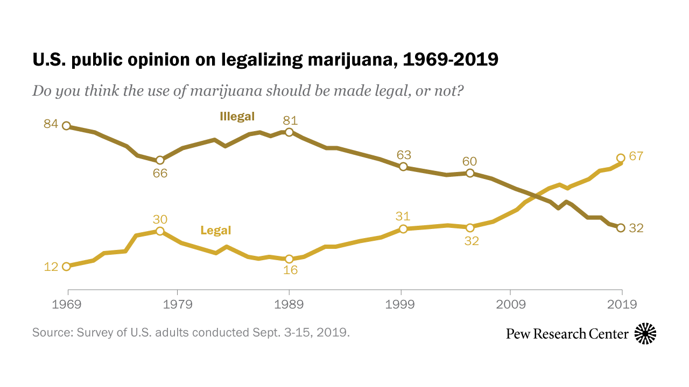

# The Marijuana Industry is the Next Boom

Marijuana is steadily gaining popularity in the United States. Admitted usage of the mind-altering drug has been [increasing steadily since the 1969](https://news.gallup.com/poll/214250/say-tried-marijuana.aspx), but really started to take off in the mid-2010s. The reasons for this vary from medical purposes to its image as a safer version of alcohol to the simple fact that it's none the governments business to tell us we shouldn't use it.

According to a 2017 Gallup poll, 45% of American adults had admitted to use of the drug.

While the Gallup poll does emphasize that this is the percent of people that __have__ smoked, not the percent that smoke currently, the 12% that smoked currently, as of this 2017 poll, was a part of a similar upward trend.

## Legalization is On Its Way

Marijuana is currently well on its way towards legalization in the United States. 10 states and The District of Columbia have legalized it recreationally, more than half of the states in the country have legalized in for medical purposes, and according to a [Pew Research Center survey](https://www.pewresearch.org/fact-tank/2019/11/14/americans-support-marijuana-legalization/) taken in September of this year, public support for legalization has reached 67% amount adults. The House Judiciary Committee has even approved legalizing it Federally within the last month, though this means very little about its actual legalization with the current Senate.

Despite potential roadblocks to legalization that may be slowing things down, marijuana is going to be legal soon, and those looking at that fact from the business side of things would be wise not to wait for a Federal green light to start looking into the industry. [Three of the fastest growing marijuana companies in the world](https://finance.yahoo.com/news/25-biggest-marijuana-companies-world-164421405.html) are currently headquartered in the US, with Arena Pharmaceuticals Inc. from California, iAnthus Capital Holdings Inc. from New York, and Cara Therapeutics Inc. from Connecticut all seeing growths rates in the thousands of percents. In 2018, the legal marijuana industry across all US states was estimated to be valued at $10.4 billion dollars, according to [New Frontier Data](https://apnews.com/0bd3cdbae26c4f99be359d6fe32f0d49). The industry is happening, regardless of the laws. And regardless of your interest in taking part in the industry.

# How do we enter the industry?

I have created a blueprint for an app that suggests marijuana strains to the user. Using a free dataset from Kaggle that had data on about 2,800 strains of marijuana, including name, type, user rating, effects, flavors (technically called terpenes in the industry), and a short description, I have created an unsupervised machine learning algorithm that predicts how similar different strains will be to one another, and tells you what it thinks are the ten most similar strains to the strain that you type into it.

Data on each strain is primarily 1s and 0s on key data points, such as Sativa, Indica, or Hybrid from the type column, the varying effects listed in the effect column, and a long list of key words, such as medical uses and parent strains, found in the description column. Needless to say, this dataset was far from perfect. The parent THC and CBD are possibly the most important factors when determining a user’s opinion of the strain, but that data was in so few of the descriptions that I was unable to factor it in for the algorithm. I was able to do was look for terms like 'high CBD' or 'THC heavy' in the description section, but being able to show the actual percentage instead of just 1s and 0s would be far more accurate. Despite that fact, the app seems to do a very good job at finding similarities that I was unaware of.

GSC, formally known as Girl Scout Cookies, has been a strain that I have found to help with stress and anxiety, and has been a personal favorite that I've had to hunt down due to a lack of local popularity. According to Leafly, the strain makes a user Happy, Relaxed, Euphoric, Uplifted, and Creative and it helps with Stress, Depression, Pain, Anxiety, and Insomnia.

My Strain Suggester told me that The White, a strain I had never heard of before, was very similar. Upon checking Leafly, I found that users claim that it makes them feel Relaxed, Happy, Euphoric, Uplifted, and Sleepy and that it helps with Stress, Pain, Anxiety, Insomnia, and Depression.

The negative effects and flavors are also very similar between the strains, despite my choice to not include either in the algorithm, as are the THC levels of 19% for GSC and 20.5% for The White and CBD levels of below 1% for both, despite my inability to extract that information from the data provided. The app predicted a similarity of 91.43%, so a user can expect it to be close, but not identical.

The end goal of this algorithm is for it to work in conjunction with an app like Leafly. Leafly is the most reliable source of marijuana user data available on the internet currently. It not only has access to the THC and CBD percents that the current data set is missing, but it has more specific, user provided, numbered data on medical uses and both positive and negative effects of each strain instead of just a yes or no. If we were able to get these data points for all the strains on their website, the suggester would offer much more accurate suggestions and be far more helpful to the user. And if the strain suggester managed to get on to the website, it would be an incredible new feature. The ability to add clickable links to the suggested strains would allow the user to go to the new strain's page, where they could see more clearly how it is similar and see if the features that they liked most about the original strain are mirrored in a way they see as good.
